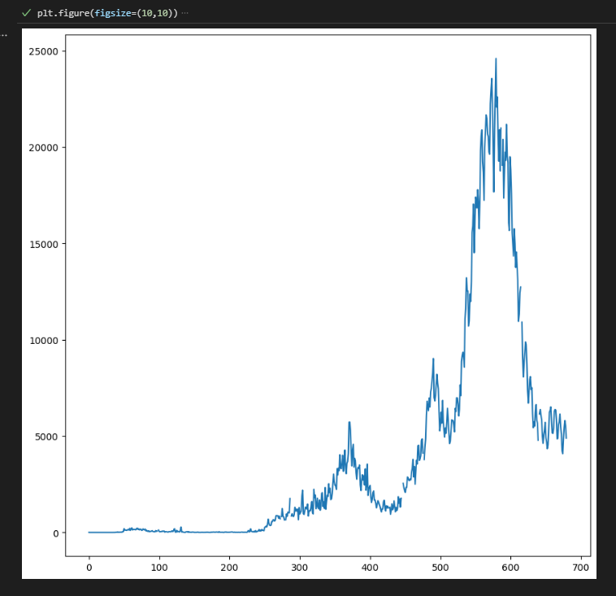
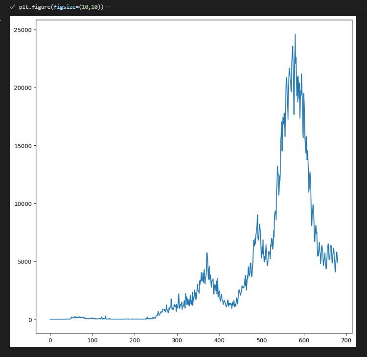
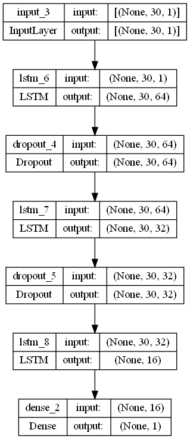
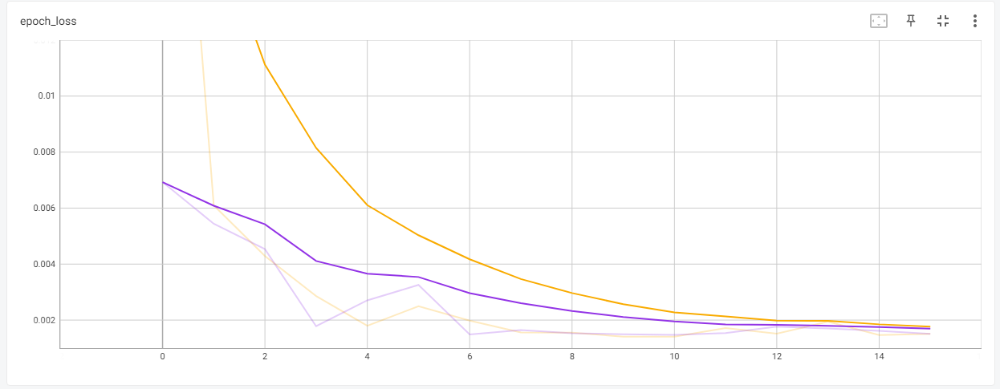
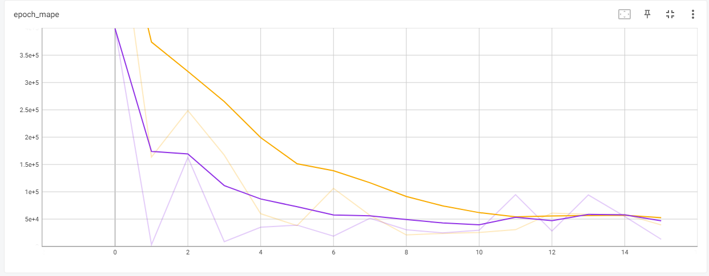
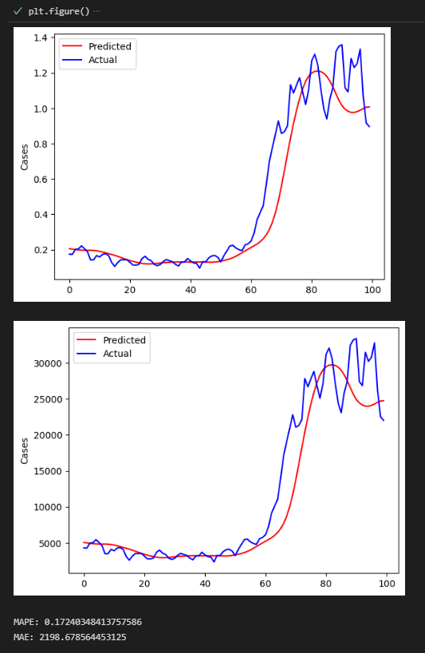

# Predicting New Covid-19 Cases in Malaysia by using TensorFlow

## Summary

Humanity experienced a catastrophe in the year 2020. The first case of pneumonia with an unknown cause was recorded in December 2019. Since then, COVID-19 has spread around the world and has become a pandemic. The epidemic hit more than 200 countries, and many of them implemented travel restrictions, quarantines, social distances, event postponements, and lockdowns in an effort to preserve the lives of their citizens. However, the governments' efforts were compromised by their slack behaviour, which made the virus more likely to spread widely and result in fatalities. The lack of an AI-assisted automated tracking and prediction system, according to scientists, is what has led to the COVID-19 pandemic's rapid spread.

Therefore, the scientist suggested using a deep learning algorithm to forecast the daily COVID cases to decide whether or not travel prohibitions should be implemented.

This project is to predict the number of Covid-19 cases in Malaysia by using past 30 days of Covid-19 cases.

There are 5 steps need to be done to complete this project which are:

1. Data Loading

  <ol>- Upload the dataset using pandas</ol>
  <ol>- Use pd.read_csv( <strong>your_path.csv</strong> )</ol>
  

2. Data Inspection

   <ol>- Inspect the dataset to check whether the dataset contains NULL or any other unwanted things.</ol>
   <ol>- I used <strong>df.info()</strong> to explore the data. The datatype for <em>new_cases</em> is object. It means that, there is something besides numerical value in the dataset.</ol>
   <ol>- Then, I used <strong>df.isnull().sum()</strong> to find the amount of NaN in the data. As for now, there is no NaN value in the data. However, we can still check if there is NaN value in the dataset, again.</ol>

3. Data Cleaning

   <ol>- Data cleaning need to be done to increase overall productivity and allow for the highest quality information in your decision-making.</ol>
   <ol>- I used interpolate to convert any values that is not in numerical to numericals. Then, the data can be visualized clearly by using graphical method</ol>
   

   
<ol> As we can see in the graph, there is missing value in between 400 to 500. Thus, the missing value can be filled by using interpolate.</ol>

   

   
<ol> Based on the graph above, the missing value already been filled. </ol>

4. Features Selection

   <ol>- In this data, I selected <em>new_cases</em> to do the predictions.</ol>
          

5. Data Pre-processing

   <ol>- <strong>MinMaxScaler</strong> is being used in this part to convert the data into 0 until 1.</ol>
   <ol>- I did train-test-split to split the <em>X_train</em> and <em>y_train</em></ol>
   

Then only we can do <strong>Model Development</strong>.

 
 a) In Model Development, I used Input as an input layer.

 
 b) For hidden layers, I used 3 LSTM layers and 2 dropouts.

 

  
  
 c) The graph can be visualized by using TensorBoard. The graphs below shows the training data and validation data of my model.

 

 
<ol> The graph above shows the loss data.</ol>

 
 
After that, we can proceed to do predictions for testing data.

 
1. Data Loading

 
- I start uploading the Testing Dataset by using pandas as well.

 
 
2. Data Inspection

 
- I did <strong>df_test.info()</strong> to look at the datatypes. The datatype for <em>new_cases</em> is float.

 
 
3. Data Cleaning

 
- I converted the dataype of <em>new_cases</em> to <strong>integer</strong>

 
 
4. Features Selection

  
- In this process, we also choose <em>new_cases</em> only.

  
  
5. Data Pre-processing

  
- In this part, I combine the training and testing data by using concatenation.

  
- Then, I proceed to find the predicted_case.

  
 

 
<ol> This is the MAPE graph. As we can see in the graph, the training data which is in orange colour starts to overfitting at 12-axis. However, it then went down. It might be due to <em>Dropout layer</em> in the model and also, the node value in LSTM layer before the output layer.</ol>

  
 
 Then, the project is being compiled. This is my MAPE result which is below than 1% and also, the MAPE graphs:

 

 

## Acknowledgement
Special thanks to ([https://github.com/MoH-Malaysia/covid19-public](https://github.com/MoH-Malaysia/covid19-public.git))) :smile:

